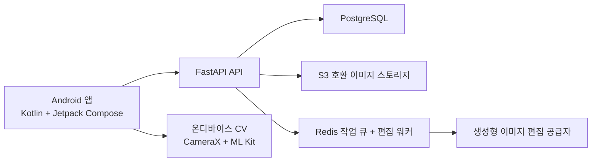

# MOODFRAME 2인 개발 로드맵

> 작성 기준: `MOODFRAME 서비스 제안서` 분석 결과  
> 목표: **7일 안에 사용자가 고른 사진 취향을 실시간 촬영 가이드와 사후 보정으로 재현하는 Android 우선 시연 버전을 2인이 완성한다.**

## 1. 제품 정의와 우선순위

MOODFRAME은 사진을 새로 만들어 주는 AI 서비스가 아니라, 사용자가 실제로 찍은 사진을 중심으로 **취향 발견 → 촬영 지원 → 결과 복구**를 연결하는 개인화 카메라다.

첫 릴리스에서 반드시 하나의 흐름으로 완성할 사용자 여정은 다음과 같다.

```text
취향 카드 선택 → 스타일/레퍼런스 선택 → 실시간 단일 가이드
→ 자동 촬영 → 기본 보정 → 선택형 생성 복구 → 결과 선택·피드백
```

### 1.1 첫 릴리스 범위

- Android 단일 플랫폼, Kotlin 네이티브 구현
- 1인 인물 사진 우선
- 세로 4:5, 정사각형 1:1 비율
- `Clean Social`, `Soft Film`, `Bright Review` 3개 스타일
- 얼굴·인물 위치·인물 크기·머리 위 여백·수평·밝기 기반 실시간 안내
- 조건 충족 시 자동 촬영
- 수평, 크롭, 노출, 색온도, 대비, 채도 기반 기본 보정
- 레퍼런스 구도 오버레이 및 유사도 안내
- 객체 제거 또는 여백 확장 중 하나 이상의 생성 복구
- 원본 / 기본 보정 / 스타일 보정 / 생성 결과 비교

### 1.2 후속 릴리스 범위

- iOS 앱
- 2인 이상 포즈·커플 촬영 고도화
- 음식, 풍경, 제품별 특화 가이드
- 사용자별 자체 스타일 임베딩 모델 학습
- 복잡한 재조명·고해상도 아웃페인팅
- 얼굴 형태, 신체 비율, 나이 등 정체성을 바꾸는 보정

## 2. 2인 역할 분담

| 담당 | 주 책임 | 주요 산출물 |
| --- | --- | --- |
| A - 모바일·카메라 | Kotlin/Compose UI, CameraX, 센서, ML Kit 연동, 오버레이, 자동 촬영, 로컬 보정 | 실제 촬영 가능한 Android 앱 |
| B - 백엔드·CV·생성 | 스타일 구조, 구도 점수, FastAPI, DB/스토리지, 편집 작업 큐, 생성 API, 결과 검증 | 개인화·편집이 연결된 서버 |
| 공동 | UX 결정, 스타일 카드 제작, 테스트 촬영, 데모, 사용자 테스트 | 통합 품질과 발표 자료 |

### 협업 원칙

- Day 1부터 API의 더미 응답과 임시 결과 이미지를 써서 전체 흐름을 연결한다.
- 매일 최소 1회 실제 Android 기기에서 통합 테스트한다.
- 기능별 완료 기준은 “코드 작성”이 아니라 “사용자가 해당 흐름을 끝까지 수행 가능”으로 판단한다.
- 카메라/가이드 경험이 막히면 생성형 편집보다 실시간 촬영 흐름을 우선한다.

## 3. 권장 기술 아키텍처



### 3.1 Android 앱

- **UI**: Kotlin, Jetpack Compose, Material 3
- **카메라**: CameraX `Preview`, `ImageAnalysis`, `ImageCapture`
- **실시간 분석**: ML Kit Face Detection, Pose Detection, Image Labeling
- **센서**: Gyroscope, Accelerometer, Orientation
- **로컬 보정**: OpenCV 또는 Android RenderEffect / GPU 셰이더
- **로컬 데이터**: Room (스타일, 최근 촬영, 편집 이력)
- **네트워크**: Retrofit/OkHttp, SSE 또는 주기적 폴링

`ImageAnalysis`에는 최신 프레임만 유지하는 backpressure 전략을 사용한다. 분석이 느려도 카메라 프리뷰가 멈추지 않아야 한다.

### 3.2 서버

- **API**: Python FastAPI
- **DB**: PostgreSQL
- **스토리지**: S3 호환 버킷
- **비동기 작업**: Redis + Celery/RQ 등 작업 워커
- **배포**: API 서버와 워커 분리, 비밀 키는 서버 환경 변수에서만 관리
- **생성형 편집**: `GenerativeEditProvider` 인터페이스를 두어 공급자 교체 가능하게 구성

### 3.3 생성형 복구 원칙

- 생성형 기능은 사용자가 명시적으로 실행할 때만 서버로 업로드한다.
- 전체 사진 재생성보다 선택 영역의 객체 제거, 빈 영역 채우기를 우선한다.
- 얼굴 영역은 보호 마스크로 지정하고, 생성 전후 유사도가 크게 달라진 결과는 폐기한다.
- 실패하면 재시도보다 기본 보정 결과를 즉시 제공한다.

## 4. 핵심 기능 명세

### 4.1 스타일 시스템

스타일은 단순 필터 이름이 아니라 촬영 가이드 값과 보정 값을 함께 가지는 구조다.

```text
StylePreset
- id, name, targetAspectRatio
- subjectScaleRange, subjectAnchorX, subjectAnchorY
- headroomRange, horizonPosition, cameraPitchRange
- exposureBias, colorTemperature, contrast, saturation
- grain, vignette, blurStrength
- guidePriority, generativeEditPolicy
```

초기 스타일 정의:

| 스타일 | 촬영 특징 | 보정 특징 |
| --- | --- | --- |
| Clean Social | 정돈된 배경, 삼분할 인물 배치, 적당한 여백 | 따뜻한 색감, 낮은 입자, 선명한 노출 |
| Soft Film | 넓은 배경, 자연스러운 중심 이탈 | 낮은 대비, 페이드, 약한 색 편향과 입자 |
| Bright Review | 중앙 피사체, 정보가 잘 보이는 구도 | 밝은 노출, 자연스러운 화이트밸런스, 선명도 |

### 4.2 실시간 가이드

프레임마다 다음 값을 계산한다.

- 인물·얼굴 중심점과 화면 점유율
- 인물과 화면 경계 사이의 여백, 머리 위 여백
- 수평 기울기, 기기 흔들림, 밝기·역광 가능성
- 포즈 랜드마크 신뢰도
- 현재 프레임과 스타일 목표의 차이

초기 점수는 설명 가능하게 단순화한다.

```text
matchScore =
  0.35 * composition +
  0.25 * subjectScale +
  0.15 * headroom +
  0.15 * horizon +
  0.10 * lighting
```

안내 규칙:

1. 한 프레임에 한 행동만 제시한다.
2. 우선순위는 `인물 미검출 → 수평 → 인물 위치 → 거리/크기 → 여백 → 밝기`다.
3. 문구는 최소 0.8초 유지하고, 이동 평균과 히스테리시스로 깜빡임을 방지한다.
4. 목표 점수가 0.5~1초 유지될 때만 자동 촬영한다.

예시 문구:

- `오른쪽으로 한 걸음 이동하세요.`
- `카메라를 조금 낮춰주세요.`
- `얼굴 위 여백을 줄여주세요.`
- `휴대폰을 시계 방향으로 돌려주세요.`

### 4.3 보정 파이프라인

```text
1. 기하학: 수평 → 회전 → 원근 → 자동 크롭
2. 광학: 노출 → 화이트밸런스 → 대비 → 하이라이트/그림자 → 노이즈
3. 스타일: 색온도 → 채도 → 톤 곡선 → 입자 → 비네팅
4. 의미 기반: 인물 분리 → 배경 흐림 → 부분별 보정
5. 생성형: 객체 제거 / 빈 공간 생성 / 여백 확장
6. 검증: 얼굴 변화, 손·배경 오류, 원본과의 과도한 차이 검사
```

### 4.4 주요 API

```text
POST /style-profiles/onboarding
GET  /styles/recommended
POST /references/analyze
POST /captures/analyze
POST /edit-jobs
GET  /edit-jobs/{id}
POST /feedback
```

편집 요청은 항상 비동기로 처리한다. `POST /edit-jobs`는 작업 ID를 반환하고, 앱은 진행 상태와 결과 후보를 조회한다.

## 5. 데이터 설계

| 엔티티 | 핵심 필드 |
| --- | --- |
| User | id, 설정, 개인정보 동의, 기본 보정 강도 |
| StyleProfile | 사용자별 구도·색감 선호, 자주 쓰는 비율, 스타일 가중치 |
| StylePreset | 이름, 대표 이미지, 구도/색상 파라미터, 생성 정책 |
| ReferenceImage | 소유자, 이미지 URI, 분석 결과, 포즈/색상/구도 특징 |
| ShootingSession | 선택 스타일, 장면 종류, 안내 로그, 최종 일치도 |
| Capture | 원본 URI, 촬영 조건, 분석 결과, 최종 선택 결과 |
| EditJob | 요청 옵션, 상태, 입력 이미지, 결과 후보, 실패 원인 |
| Feedback | 저장 여부, 선호 결과, 구도/색감 피드백 |

## 6. UX·디자인 방향

### 6.1 화면 구성

1. **온보딩**: 서비스 소개 → 권한 → 감성 사진 카드 5장 이상 선택 → 초기 프로필
2. **홈**: 바로 촬영, 사진 살리기, 레퍼런스 따라 찍기, 추천 스타일
3. **스타일 탐색**: 3개 기본 스타일, 저장 스타일, 강도 조절
4. **카메라**: 프리뷰, 목표 프레임, 단일 안내, 일치도 링, 자동 촬영 토글
5. **결과 비교**: 원본/기본/스타일/생성 결과, 전후 슬라이더, 저장·공유
6. **내 스타일**: 선호 구도·색감·자주 쓰는 비율·최근 스타일

### 6.2 카메라 화면 원칙

- 어두운 차콜 기반 UI로 프리뷰가 화면의 주인공이 되게 한다.
- 상단에는 스타일 이름과 변경 버튼만 둔다.
- 중앙에는 반투명 목표 프레임 또는 실루엣을 표시한다.
- 하단에는 한 줄 행동 지시와 방향 화살표를 둔다.
- 점수는 숫자 대신 얇은 원형 게이지와 3단계 색상으로 표현한다.
- 자동 촬영 직전에는 진동과 짧은 3-2-1 링 애니메이션을 제공한다.

## 7. 7일 집중 구현 일정

7일은 상용 베타를 만드는 기간이 아니라 **한 가지 핵심 사용자 여정을 실제 기기에서 끊김 없이 시연하는 기간**이다. 따라서 다인 포즈, 복잡한 추천 학습, 복수 생성 기능은 기능 플래그 또는 후속 항목으로 남긴다.

| 일자 | A - 모바일·카메라 | B - 백엔드·CV·생성 | 당일 완료 기준 |
| --- | --- | --- | --- |
| Day 1 | Kotlin 프로젝트, 권한, 홈/온보딩 골격, CameraX 프리뷰와 촬영 | FastAPI 골격, 로컬/클라우드 저장소 연결, API 계약, 프리셋 JSON | 실제 기기에서 스타일 선택 후 사진 저장 가능 |
| Day 2 | 얼굴 박스, 인물 위치, 수평 오버레이 | ML Kit 분석 래퍼, 구도 특징/점수 계산 | 현재 프리뷰에 인물 위치·수평 결과가 표시 |
| Day 3 | 단일 안내 UI, 목표 프레임, 진동, 자동 촬영 | 안내 우선순위, 이동 평균, 히스테리시스 | `오른쪽 이동` 등 한 가지 안내와 자동 촬영 동작 |
| Day 4 | 결과 화면, 전후 슬라이더, 로컬 수평/크롭/색감 보정 | 캡처 분석 API, 스타일 파라미터 전달, 편집 작업 상태 API | 원본·기본 보정·스타일 보정 비교 가능 |
| Day 5 | 레퍼런스 업로드, 투명 오버레이, 생성 요청/진행 UI | 레퍼런스 구성 분석, 객체 제거 또는 여백 확장 한 가지 연동 | 레퍼런스 안내 또는 생성 복구 중 최소 하나가 실동작 |
| Day 6 | 오류 상태, 권한 거부 처리, 저장/공유, 피드백 UI | 작업 실패 대체, 업로드 자동 삭제, 이벤트 로그/피드백 저장 | 네트워크·생성 실패에도 기본 보정 결과 제공 |
| Day 7 | 실기기 성능 조정, 화면 폴리싱, 시연 모드, 영상 녹화 | 비용 제한, 로그 확인, API 안정화, 테스트 이미지 검증 | 데모 시나리오 A/B를 처음부터 끝까지 재현 |

### 7.1 일별 운영 규칙

- 매일 오전 15분에 오늘의 데모 완료 기준을 확정한다.
- 매일 저녁 실제 기기에서 앱과 서버를 함께 실행해 3회 이상 촬영한다.
- Day 3 종료 시점에 자동 촬영이 불안정하면, 자동 촬영은 버튼 촬영과 병행하고 가이드 품질을 우선한다.
- Day 5 종료 시점에 생성 API가 불안정하면, 고정된 테스트 이미지 결과를 사용하지 말고 생성 기능을 숨긴 뒤 기본 보정 데모를 완성한다.
- Day 6 이후에는 새로운 핵심 기능을 추가하지 않고 오류·성능·데모 품질만 개선한다.

## 8. 성능·품질 목표

- 카메라 프리뷰: 30 FPS 이상
- 분석 프레임: 초당 10~20회
- 안내 갱신 지연: 200ms 이하
- 안내 문구 유지: 최소 0.8초
- 자동 촬영 판단: 0.5~1초 유지
- 앱 실행 후 첫 분석: 2초 이내
- 기본 보정: 2초 이내
- 생성 결과 실패 시: 기본 보정 결과 즉시 제공
- 첫 실행부터 첫 촬영까지: 1분 이내

### 사용자 테스트 지표

- 첫 촬영 완료율
- 일반 카메라 대비 구도 개선 비율
- 촬영 결과 저장률
- 스타일 재사용률
- 레퍼런스 재현 만족도
- 생성 결과 폐기율과 재생성 횟수

## 9. 개인정보·안전·비용

- 얼굴 위치, 포즈, 수평, 기본 보정은 가능한 한 기기에서 처리한다.
- 서버 업로드는 생성 복구에 필요한 경우에만 하고, 목적과 보관 기간을 명시한다.
- 서버 원본은 편집 완료 후 자동 삭제한다.
- 데이터 학습 활용은 기본 비활성화하고 별도 동의를 받는다.
- 이미지의 EXIF 위치 정보는 서버 전송 전 제거한다.
- 생성형 편집 여부는 앱 내 이력에 표시한다.
- 생성 요청의 횟수, 이미지 해상도, 편집 영역 크기에 제한을 둔다.
- API 키와 생성형 공급자 자격 증명은 앱에 절대 포함하지 않는다.

## 10. 데모 시나리오

### A. 원하는 사진 따라 찍기

1. 사용자가 `Clean Social` 또는 레퍼런스 사진을 선택한다.
2. 앱이 목표 인물 위치와 비율을 표시한다.
3. `오른쪽으로 이동`, `카메라를 낮춤` 같은 단일 안내를 제공한다.
4. 일치도가 유지되면 자동 촬영한다.
5. 레퍼런스와 결과를 나란히 보여주고 색감을 적용한다.

### B. 망한 사진 살리기

1. 기울고 어두우며 배경이 복잡한 사진을 선택한다.
2. 앱이 수평, 과도한 여백, 방해 요소, 어두운 얼굴을 진단한다.
3. 기본 보정과 스타일 보정을 먼저 보여준다.
4. 사용자가 방해 요소 제거 또는 여백 확장을 선택한다.
5. 원본과 최종 결과를 슬라이더로 비교한다.

## 11. 최종 완료 기준

아래 조건을 충족하면 첫 베타를 완료로 판단한다.

- 사용자가 취향을 선택하고 실제 카메라에서 한 가지씩 구도 안내를 받는다.
- 목표 구도에 맞으면 자동 촬영된다.
- 결과 사진에 기본 보정과 스타일 보정이 적용된다.
- 생성형 복구를 선택할 수 있으며, 실패 시에도 결과 흐름이 끊기지 않는다.
- 원본이 보존되고, 서버 업로드와 삭제 정책이 사용자에게 명확히 안내된다.
- 실제 Android 기기에서 전체 데모 시나리오를 처음부터 끝까지 재현할 수 있다.

## 12. 첫날 실행 체크리스트

- [ ] Android 프로젝트와 FastAPI 서버를 생성하고 API 계약을 문서화한다.
- [ ] `StylePreset` JSON 3종과 온보딩 카드 15~20장을 준비한다.
- [ ] CameraX 프리뷰와 사진 저장을 실제 기기에서 확인한다.
- [ ] 얼굴 검출 결과를 카메라 오버레이로 렌더링한다.
- [ ] PostgreSQL 스키마와 이미지 스토리지 버킷을 구성한다.
- [ ] 더미 `POST /edit-jobs` 응답으로 결과 화면까지 연결한다.
