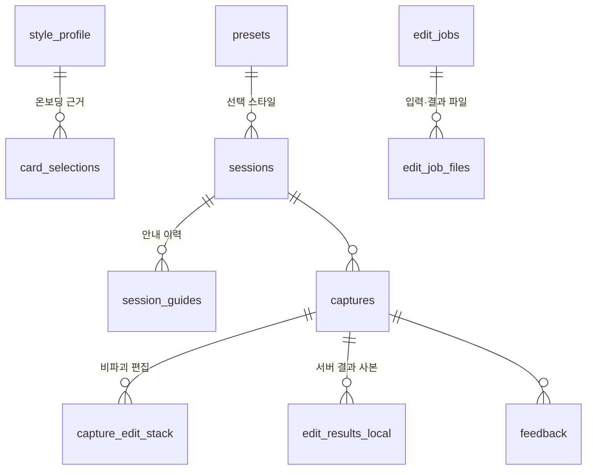

# 감도 (GAMDO) — DB 스키마 설계서 v2.0 (로컬 우선 확정판)

| | |
|---|---|
| **문서** | DB 스키마 설계서 |
| **버전** | v2.0 (2026-07-23) — v1.0 전면 개정: **로그인 제거, 로컬 우선(local-first) 구조로 확정** |
| **상위 문서** | PRD v1.0 §6.3, 기능명세서 M11-02 |
| **변경 요지** | 사용자·선호도·기록은 전부 앱 로컬 DB가 원천. 서버는 "처리기"로 축소 — 편집 작업 추적 3테이블만 유지 |

---

## 0. "DB가 존재해야 할까?"에 대한 답

로그인이 없어지면 서버가 사용자를 기억할 이유가 사라진다. 따라서 v1.0의 서버 테이블 16개 중 13개(users, style_profiles, feedback, sessions 등)는 **폐기하고 로컬로 이동**한다. 그럼에도 저장소가 완전히 없어지지 않는 이유는 두 가지다.

**① 앱 로컬 DB (주 DB — 반드시 필요)**
스타일 프로필, 온보딩 선택, 비파괴 편집 스택(되돌리기), 세션·안내 기록(시연 KPI 근거), 피드백, 오프라인 재시도 큐가 모두 여기 산다. 이제 이것이 감도의 "진짜 DB"다.

**② 서버 최소 DB (작업 추적 — 유지 권장)**
생성형 편집은 비동기(요청→큐→GPU 처리→폴링)라서 요청 간 상태를 어딘가 남겨야 한다. 또 업로드된 원본을 "언제 지웠는가"를 추적해야 개인정보 정책(원본 미보관)이 검증 가능하다. 이 둘만을 위해 SQLite 테이블 3개를 유지한다.

**대안 — 서버 DB 완전 제거도 가능하다:** job 상태를 메모리 + 작업 폴더의 status.json으로 관리하면 DB 0개가 된다. 다만 서버 재시작 시 진행 중 job 유실, 삭제 배치·감사 로직을 파일 스캔으로 직접 구현, 동시 접근 처리 부담이 생긴다. FastAPI에서 SQLite 3테이블은 30분 작업이므로 **유지를 권장**하지만, 팀이 더 단순한 쪽을 원하면 파일 기반으로 가도 기능상 문제는 없다(데모 조건에서 두 방식 차이 없음).

그 외 서버 기능은 전부 **무저장(stateless)** 으로 바뀐다: 프리셋은 정적 JSON 파일 서빙, 레퍼런스 분석은 동기 응답 후 즉시 폐기(결과는 클라이언트가 로컬 캐시).

---

## 1. 설계 원칙

1. **로컬이 원천(source of truth), 서버는 처리기.** 서버는 사용자를 저장하지 않고, 요청 단위로만 안다(디바이스 ID는 작업 소유 표시·삭제 정책에만 사용).
2. PK는 접두사 있는 TEXT ID(`cap_`, `job_` + ULID) — **클라이언트가 생성**해 로컬·서버가 같은 ID를 공유한다.
3. 시각은 INTEGER(epoch ms, UTC).
4. 자주 진화하는 구조(스타일 파라미터, 분석 결과, 작업 목록)는 `"v"` 필드를 가진 JSON 컬럼으로 흡수 — 테이블 구조는 고정.
5. 열거값은 TEXT + CHECK. 값 추가만 허용, 삭제 금지.
6. 삭제는 소프트 삭제(`deleted_at`), 서버 파일 삭제는 `purge_after`/`purged_at`으로 추적.
7. 이후 동기화·백업 기능을 도입하게 되면 로컬 스키마를 그대로 서버로 승격한다(§7) — 지금 로컬 스키마를 서버 이관 가능한 형태로 설계해 두는 이유.

---

## 2. 전체 구조



**역할 분담 요약**

| 데이터 | 위치 | 이유 |
|---|---|---|
| 스타일 프로필·선호도 | 로컬 | 사용자 결정: 로컬 캐싱으로 충분 |
| 온보딩 카드 메타데이터 | 앱 번들(JSON 에셋) | 정적 데이터, DB 불필요 |
| 시스템 프리셋 6종 | 서버 정적 JSON 파일 → 로컬 캐시 | 재배포 없이 튜닝, DB 불필요 |
| 개인 프리셋·혼합 | 로컬 | 선호도의 일부 |
| 세션·안내 이력·피드백·이벤트 | 로컬 | KPI 측정은 데모 기기에서 수행 |
| 촬영 원본·편집 스택 | 로컬(파일+DB) | 원본 비파괴 원칙 |
| 편집 작업 상태 | 서버(3테이블) | 비동기 폴링·삭제 추적 |
| 레퍼런스 분석 결과 | 로컬 캐시 | 서버는 분석 후 즉시 폐기 |

---

## 3. 앱 로컬 DB — 전체 DDL (주 DB)

```sql
-- 3.1 앱 설정 (key-value)
CREATE TABLE app_settings (
  key         TEXT PRIMARY KEY,     -- 'device_uuid','onboarding_done','auto_shutter','haptic_on',
                                    -- 'default_edit_strength','learning_opt_in'(기본 '0')
  value       TEXT NOT NULL,
  updated_at  INTEGER NOT NULL
);

-- 3.2 동의 이력 (개인정보 정책의 감사 기록 — 로컬 보관)
CREATE TABLE consents (
  id             TEXT PRIMARY KEY,  -- 'cst_' + ULID
  consent_type   TEXT NOT NULL CHECK (consent_type IN
                  ('service_terms','photo_processing','server_upload','data_learning')),
  policy_version TEXT NOT NULL,
  granted        INTEGER NOT NULL,  -- 1=동의, 0=철회
  created_at     INTEGER NOT NULL
);

-- 3.3 스타일 프로필 (단일 행 — 감도의 개인화 원천)
CREATE TABLE style_profile (
  id                 INTEGER PRIMARY KEY CHECK (id = 1),
  composition_json   TEXT NOT NULL DEFAULT '{}',   -- §5.2 구도 취향
  color_json         TEXT NOT NULL DEFAULT '{}',   -- §5.2 색감 취향 — 구도와 분리 유지
  subject_prefs_json TEXT NOT NULL DEFAULT '{}',   -- 피사체 유형별 선호
  aspect_usage_json  TEXT NOT NULL DEFAULT '{}',   -- {"4:5":12,"1:1":3}
  confidence_json    TEXT NOT NULL DEFAULT '{}',   -- 차원별 확신도 0~1
  summary_text       TEXT,                         -- 일상 언어 요약
  reset_count        INTEGER NOT NULL DEFAULT 0,
  updated_at         INTEGER NOT NULL
);

-- 3.4 온보딩 카드 선택 기록 (카드 자체는 앱 번들 JSON — cards.json의 id 참조)
CREATE TABLE card_selections (
  id          TEXT PRIMARY KEY,     -- 'sel_' + ULID
  card_id     TEXT NOT NULL,        -- 번들 cards.json의 'card_01'
  round       INTEGER NOT NULL DEFAULT 1,   -- 개인화 초기화 후 재온보딩 회차
  created_at  INTEGER NOT NULL,
  UNIQUE (card_id, round)
);

-- 3.5 프리셋 (시스템 캐시 + 개인 + 혼합을 한 테이블로)
CREATE TABLE presets (
  id           TEXT PRIMARY KEY,    -- 시스템: 'clean_social' / 개인: 'pst_' + ULID
  source       TEXT NOT NULL CHECK (source IN ('system','user','blend')),
  name         TEXT NOT NULL,
  display_name TEXT NOT NULL,
  params_json  TEXT NOT NULL,       -- §5.3 StylePreset (composition+color 분리 구조)
  parent_ids   TEXT,                -- blend: '["clean_social","soft_film"]'
  version      INTEGER NOT NULL DEFAULT 1,
  etag         TEXT,                -- 시스템 프리셋 서버 캐시 검증용
  active       INTEGER NOT NULL DEFAULT 1,
  updated_at   INTEGER NOT NULL
);

-- 3.6 촬영 세션
CREATE TABLE sessions (
  id                  TEXT PRIMARY KEY,   -- 'ses_' + ULID
  mode                TEXT NOT NULL CHECK (mode IN ('style','reference','free')),
  style_preset_id     TEXT REFERENCES presets(id),
  reference_hash      TEXT,               -- cached_references.content_hash
  scene_type          TEXT CHECK (scene_type IN
                       ('person_single','person_couple','person_group',
                        'food','landscape','building','product','unknown') OR scene_type IS NULL),
  resolved_style_json TEXT NOT NULL DEFAULT '{}',  -- 세션 시점 ResolvedStyle 스냅샷(재현성)
  started_at          INTEGER NOT NULL,
  ended_at            INTEGER,
  final_match_score   REAL,
  auto_shutter_used   INTEGER NOT NULL DEFAULT 0
);

-- 3.7 실시간 안내 이력 (KPI '가이드 실효성' 근거)
CREATE TABLE session_guides (
  id          TEXT PRIMARY KEY,     -- 'gid_' + ULID
  session_id  TEXT NOT NULL REFERENCES sessions(id),
  guide_type  TEXT NOT NULL,        -- 'move_right','lower_camera','reduce_headroom',...
  message     TEXT NOT NULL,
  issued_at   INTEGER NOT NULL,
  resolved    INTEGER,              -- 1=오차 해소, 0=미해소, NULL=측정불가
  delta_json  TEXT NOT NULL DEFAULT '{}'
);
CREATE INDEX ix_guides_session ON session_guides(session_id, issued_at);

-- 3.8 촬영 결과 (원본 파일은 앱 디렉토리, DB는 메타)
CREATE TABLE captures (
  id                 TEXT PRIMARY KEY,   -- 'cap_' + ULID (서버 job과 공유되는 ID)
  session_id         TEXT REFERENCES sessions(id),   -- NULL = 갤러리 불러오기
  source             TEXT NOT NULL CHECK (source IN ('camera_auto','camera_manual','gallery_import')),
  file_path          TEXT NOT NULL,
  thumb_path         TEXT,
  analysis_json      TEXT NOT NULL DEFAULT '{}',  -- 촬영 시점 FrameFeatures
  conditions_json    TEXT NOT NULL DEFAULT '{}',  -- {tilt, shake, lux, lens, zoom}
  problems_json      TEXT NOT NULL DEFAULT '[]',  -- 사진 살리기 문제 감지
  selected_result_id TEXT,                        -- 최종 선택한 edit_results_local.id
  saved_to_gallery   INTEGER NOT NULL DEFAULT 0,
  deleted_at         INTEGER,
  created_at         INTEGER NOT NULL
);
CREATE INDEX ix_captures_created ON captures(created_at DESC);

-- 3.9 비파괴 편집 스택 (되돌리기의 원천)
CREATE TABLE capture_edit_stack (
  id          TEXT PRIMARY KEY,     -- 'stk_' + ULID
  capture_id  TEXT NOT NULL REFERENCES captures(id),
  step_order  INTEGER NOT NULL,
  step_type   TEXT NOT NULL CHECK (step_type IN
               ('geometry','optical','style','semantic','generative_ref')),
  params_json TEXT NOT NULL,        -- generative_ref는 edit_results_local.id 참조
  active      INTEGER NOT NULL DEFAULT 1,   -- 되돌리기 = 0 (삭제 아님)
  created_at  INTEGER NOT NULL,
  UNIQUE (capture_id, step_order)
);

-- 3.10 서버 편집 결과 사본 (다운로드 후 로컬 보관 — 오프라인 비교 UI용)
CREATE TABLE edit_results_local (
  id              TEXT PRIMARY KEY, -- 서버 'res_' ID 그대로
  capture_id      TEXT NOT NULL REFERENCES captures(id),
  job_id          TEXT NOT NULL,    -- 서버 'job_' ID
  kind            TEXT NOT NULL CHECK (kind IN ('natural','styled','generated')),
  generative      INTEGER NOT NULL DEFAULT 0,   -- 'AI 생성 보완' 뱃지
  seed            INTEGER,
  rank            INTEGER NOT NULL DEFAULT 0,
  file_path       TEXT NOT NULL,
  validation_json TEXT NOT NULL DEFAULT '{}',
  ops_applied_json TEXT NOT NULL DEFAULT '[]',  -- 편집 이력 표시
  created_at      INTEGER NOT NULL
);
CREATE INDEX ix_results_capture ON edit_results_local(capture_id, rank);

-- 3.11 피드백 (프로필 업데이트의 입력)
CREATE TABLE feedback (
  id                 TEXT PRIMARY KEY,   -- 'fbk_' + ULID
  capture_id         TEXT NOT NULL REFERENCES captures(id),
  choice             TEXT NOT NULL CHECK (choice IN
                      ('perfect','composition_good_color_bad','color_good_but_artificial',
                       'more_natural_next','save_this_style')),
  selected_result_id TEXT,
  saved              INTEGER NOT NULL DEFAULT 0,
  partial_json       TEXT NOT NULL DEFAULT '{}',
  applied_to_profile INTEGER NOT NULL DEFAULT 0,
  created_at         INTEGER NOT NULL
);

-- 3.12 행동 이벤트 (암묵 신호 로깅, P2)
CREATE TABLE events (
  id           TEXT PRIMARY KEY,    -- 'evt_' + ULID
  event_type   TEXT NOT NULL,       -- 'result_regenerated','result_deleted_fast','strength_lowered',...
  subject_id   TEXT,
  payload_json TEXT NOT NULL DEFAULT '{}',
  created_at   INTEGER NOT NULL
);
CREATE INDEX ix_events_type ON events(event_type, created_at DESC);

-- 3.13 서버 요청 대기열 (오프라인 재시도)
CREATE TABLE pending_requests (
  id          TEXT PRIMARY KEY,     -- 'req_' + ULID
  method      TEXT NOT NULL,
  endpoint    TEXT NOT NULL,
  body_json   TEXT NOT NULL,
  file_path   TEXT,
  retry_count INTEGER NOT NULL DEFAULT 0,
  last_error  TEXT,
  created_at  INTEGER NOT NULL
);

-- 3.14 레퍼런스 분석 캐시 (서버는 무저장 — 이곳이 유일한 보관처)
CREATE TABLE cached_references (
  content_hash  TEXT PRIMARY KEY,   -- 이미지 SHA-256
  analysis_json TEXT NOT NULL,      -- §5.4
  target_json   TEXT NOT NULL,      -- TargetComposition + ColorTarget
  palette_json  TEXT NOT NULL DEFAULT '{}',
  analysis_v    INTEGER NOT NULL DEFAULT 1,
  created_at    INTEGER NOT NULL
);
```

---

## 4. 서버 최소 DB — 전체 DDL (작업 추적 전용)

사용자 테이블 없음. `device_uuid`는 컬럼으로만 존재(작업 소유 표시·삭제 정책·간단한 남용 방지). 프리셋은 정적 JSON 파일, 레퍼런스 분석은 무저장 동기 응답.

```sql
-- 4.1 편집 작업 (비동기 큐 + 폴링 상태)
CREATE TABLE edit_jobs (
  id                TEXT PRIMARY KEY,   -- 'job_' + ULID (클라이언트 생성)
  device_uuid       TEXT NOT NULL,
  capture_ref       TEXT NOT NULL,      -- 클라이언트 'cap_' ID (FK 아님 — 서버는 captures를 모름)
  operations_json   TEXT NOT NULL,      -- §5.5 요청 작업 목록
  style_params_json TEXT NOT NULL DEFAULT '{}',  -- 클라이언트가 보낸 ResolvedStyle 스냅샷(서버 무상태)
  result_count      INTEGER NOT NULL DEFAULT 2,
  status            TEXT NOT NULL DEFAULT 'queued' CHECK (status IN
                     ('queued','processing','validating','done','failed','fallback','canceled')),
  progress_stage    TEXT,               -- 'removing','outpainting','relighting','validating'
  attempt           INTEGER NOT NULL DEFAULT 0,
  fail_reason       TEXT,               -- 'face_identity_changed','timeout','oom',...
  priority          INTEGER NOT NULL DEFAULT 5,
  queued_at         INTEGER NOT NULL,
  started_at        INTEGER,
  finished_at       INTEGER,
  created_at        INTEGER NOT NULL,
  updated_at        INTEGER NOT NULL
);
CREATE INDEX ix_jobs_queue ON edit_jobs(status, priority, queued_at)
  WHERE status IN ('queued','processing');
CREATE INDEX ix_jobs_device ON edit_jobs(device_uuid, created_at DESC);

-- 4.2 작업 파일 (입력·결과 — 삭제 정책의 추적 단위)
CREATE TABLE edit_job_files (
  id              TEXT PRIMARY KEY,     -- 'jf_' + ULID / 결과는 'res_' + ULID (클라이언트에 노출)
  job_id          TEXT NOT NULL REFERENCES edit_jobs(id),
  role            TEXT NOT NULL CHECK (role IN ('input','result')),
  kind            TEXT CHECK (kind IN ('natural','styled','generated') OR kind IS NULL),  -- result만
  generative      INTEGER NOT NULL DEFAULT 0,
  seed            INTEGER,
  rank            INTEGER NOT NULL DEFAULT 0,
  validation_status TEXT NOT NULL DEFAULT 'skipped' CHECK
                   (validation_status IN ('passed','failed','skipped')),
  validation_json TEXT NOT NULL DEFAULT '{}',   -- {faceDist:0.21, threshold:0.35} — 임베딩 자체는 저장 금지
  ops_applied_json TEXT NOT NULL DEFAULT '[]',
  storage_path    TEXT NOT NULL,
  bytes           INTEGER,
  exif_stripped   INTEGER NOT NULL DEFAULT 1,   -- 위치 EXIF는 수신 시 제거 (정책상 항상 1)
  delivered_at    INTEGER,                      -- 클라이언트 수신 확인
  purge_after     INTEGER,                      -- 삭제 예정 시각
  purged_at       INTEGER,                      -- 실제 삭제 시각 (감사 기록)
  created_at      INTEGER NOT NULL,
  updated_at      INTEGER NOT NULL
);
CREATE INDEX ix_jobfiles_job ON edit_job_files(job_id, role, rank);
CREATE INDEX ix_jobfiles_purge ON edit_job_files(purge_after)
  WHERE purge_after IS NOT NULL AND purged_at IS NULL;

-- 4.3 스키마 버전
CREATE TABLE schema_migrations (
  version    TEXT PRIMARY KEY,          -- '001_initial'
  applied_at INTEGER NOT NULL
);
```

**삭제 정책 매핑:** `input` → job 종료(done/failed/fallback) 시 `purge_after=now`. `result` → `delivered_at` 기록 시 `purge_after=+24h`. 삭제 배치는 1분 주기로 `ix_jobfiles_purge` 스캔. 레퍼런스 업로드는 애초에 DB에 오르지 않고 분석 응답 직후 임시 파일 삭제.

---

## 5. JSON 필드 페이로드 스키마

모든 페이로드는 `"v": 1` 포함. 구조 변경은 v 증가로 해결하고 테이블은 불변.

**5.1 CardFeature** — 앱 번들 `cards.json` (v1.0 §5.1과 동일: subjectScale, subjectPosition, headroom, backgroundRatio, brightness, lightType, colorTemperature, saturation, contrast, sharpness, grain, candidness, framing)

**5.2 StyleProfile 페이로드** (`style_profile.composition_json` / `color_json`) — 각 차원 `{mean, conf}` 구조 (v1.0 §5.2와 동일)

**5.3 StylePreset 파라미터** (`presets.params_json`) — 기능명세서 M3-01 스키마와 동일

**5.4 레퍼런스 분석** (`cached_references.analysis_json`) — 기능명세서 §10 `POST /references` 응답과 동일

**5.5 편집 작업 목록** (`edit_jobs.operations_json`) — 허용 type: `remove_objects` `simplify_background` `outpaint` `fill_rotation_gap` `relight` `eye_fix` `deblur_light` `skin_tone_even`. **금지 작업은 스키마 차원에서 미정의**(얼굴·신체 형태 변경, 나이·인종 변경, 타인 얼굴 합성).

---

## 6. 데이터 수명 주기

| 데이터 | 위치 | 삭제 시점 |
|---|---|---|
| 촬영 원본·편집 스택·결과 사본 | 로컬 | 사용자가 삭제할 때까지 (원본 비파괴) |
| 스타일 프로필·피드백·세션 기록 | 로컬 | 개인화 초기화 또는 앱 삭제 |
| 서버 업로드 원본(edit input) | 서버 | job 종료 즉시 (`purge_after=now`) |
| 서버 결과 파일 | 서버 | 수신 확인 +24h |
| 레퍼런스 업로드 | 서버 | 분석 응답 직후 (DB 기록 없음) |
| 얼굴 임베딩(검증용) | 서버 메모리 | 검증 직후 폐기 — **저장 컬럼 없음** |
| 위치 EXIF | — | 수신 시 스트립 — 저장 자체 없음 |
| job 메타(파일 아닌 행) | 서버 | 7일 후 배치 삭제 (디버깅 유예) |

**주의:** 로컬이 원천이므로 **앱 삭제 = 데이터 전체 소실**이다. 온보딩 개인정보 안내에 이 사실을 명시하고, 정식 버전에서 백업·동기화 도입 여부는 §7의 확장 경로로 처리한다.

---

## 7. 확장 경로 (스키마 불변 근거)

- **동기화·백업 도입 시:** 로컬 테이블(style_profile, presets, captures 메타)을 서버로 그대로 승격한다 — 로컬 스키마가 이미 TEXT ID·epoch ms·JSON 페이로드 구조라 서버 PostgreSQL에 1:1 복제 가능. 이때 서버에 계정 개념이 처음 생기며, 익명 디바이스 기반 연결로 시작해도 된다(로그인 필수 아님).
- **PostgreSQL 이관(서버 3테이블):** TEXT(JSON)→JSONB, INTEGER(epoch)→BIGINT, INTEGER(bool)→BOOLEAN. 이름·제약 동일, 쿼리 무수정.
- **S3 전환:** `edit_job_files.storage_path`에 s3 키 기록(프로토타입은 로컬 경로) — 컬럼 그대로.
- **다중 GPU 워커:** `edit_jobs`의 status·priority 큐 구조가 그대로 워커 N개를 지원(행 잠금만 추가).

## 8. 시드·초기화

1. 앱 번들: `cards.json`(카드 20장 메타), 프리셋 6종 기본값(서버 미접속 시 폴백)
2. 서버: `schema_migrations` '001_initial', 정적 `presets.json` 파일 배치
3. 앱 최초 실행: `app_settings`에 device_uuid 생성, `style_profile` 기본 행(id=1) 삽입

## 9. 스키마 동결 규약 (v1.0에서 유지)

1. 컬럼 이름 변경·삭제 금지 — 새 요구는 NULL 허용 컬럼 추가 또는 JSON `v` 증가로.
2. CHECK 열거값은 추가만 허용.
3. 얼굴 임베딩·위치 정보의 영구 저장 컬럼 추가 금지.
4. 마이그레이션은 항상 additive — 구버전 앱이 깨지지 않아야 한다.
5. 서버는 사용자 상태를 저장하지 않는다 — "서버에 사용자 테이블을 만들자"는 제안은 §7 동기화 도입 결정 없이는 기각.

---

*v2.0은 "로그인 없음 + 선호도 로컬 보관" 결정(2026-07-23)을 반영한 전면 개정판이다. v1.0은 폐기한다.*
